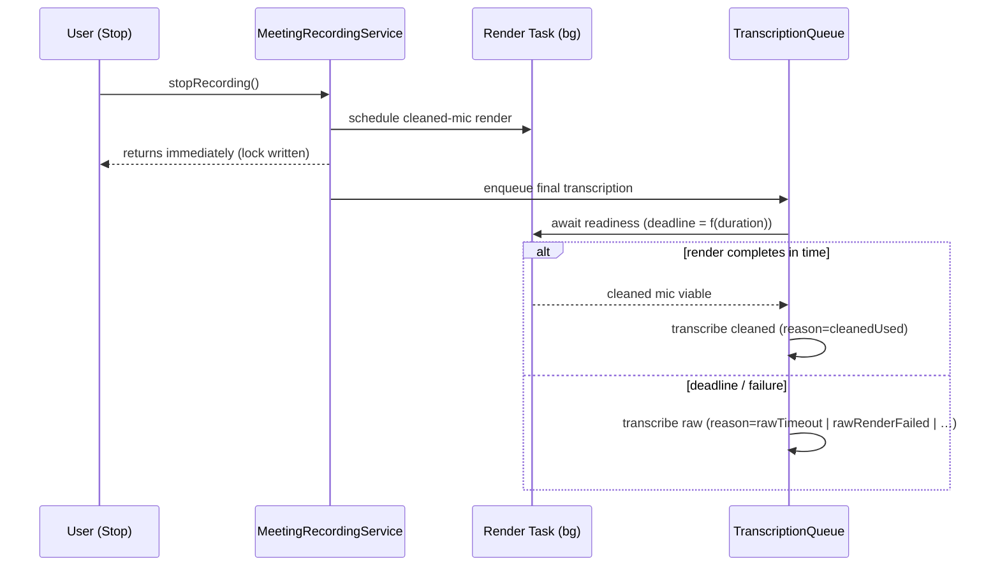

# PR Description Guidelines

> Status: **ACTIVE** — the deep guide behind the summary in
> [`docs/pr-review-workflow.md`](./pr-review-workflow.md). Sibling of
> [`docs/commit-guidelines.md`](./commit-guidelines.md).

The commit message and the PR description serve two different readers.
The commit message is a letter to the **future archaeologist** who
arrives via `git blame` with no context. The PR description is a map
for the **present-tense reviewer** deciding whether this change may
merge — and, secondarily, the permanent record GitHub renders wherever
the PR is linked (issues, release notes, other PRs).

## The spirit

The litmus test:

> *A reviewer who has never seen the branch should finish the
> description knowing what changed and why, how the pieces interact,
> how to verify it, and where to look hardest — before reading a line
> of the diff.*

Don't duplicate the commit message; aggregate and elevate it. The
commit carries the full reconstruction record (seed prompt, per-file
rationale). The PR body carries what a reviewer needs to *act*: the
shape of the change, its risk surface, and its evidence.

## The default scaffolding

```text
<title> (imperative, specific; the release-notes writer may reuse it)

## Summary
Two to four sentences: the problem, the shape of the solution, and
the user-visible consequence. Written so a smart reader who wasn't in
the room gets it on the first pass.

## Design
The settled decisions and why — link the brief/plan/ADR that governed
the work rather than re-arguing it. Note decisions the diff makes
that the brief did NOT settle.

## How it works
<!-- Visual section; see "Show, don't narrate" -->
Sequence / flow / state diagram, or before→after table — whichever
single visual makes the mechanism obvious. Skip entirely when the
change has no structural story (copy edits, version bumps).

## Risk surface
What could plausibly break, which paths are hot (concurrency,
persistence, privacy, contracts), and what you'd review hardest if
you were the reviewer. Name what is deliberately out of scope.

## Test evidence
What ran and passed (suite counts, focused filters, manual smokes),
what is NOT covered and why. Commands the reviewer can replay.

## Author's Notes (optional — same convention as commit-guidelines.md)
Honest first-person signal: uncertainties, brief disagreements,
debt left behind.
```

As with commits: the scaffolding is a default, not a specification.
A doc-only PR earns a paragraph. A subsystem-touching PR earns the
full treatment.

## Show, don't narrate

GitHub renders [Mermaid](https://mermaid.js.org/) natively inside
```` ```mermaid ```` fences. One good diagram beats three paragraphs
of prose about ordering. Pick by the change's shape:

| The change is… | Show it as… |
|---|---|
| Async coordination across ≥2 actors/tasks | **Sequence diagram** |
| A lifecycle or mode change | **State diagram** |
| Branching decision logic | **Flowchart** |
| Data moving/transforming between stages | **Data-flow diagram** |
| Same inputs, different outcomes | **Before→after table** |
| UI | **Screenshots** (before/after pair, dark + light when relevant) |

Rules that keep diagrams honest:

- **Diagram the change, not the system.** ≤ ~12 nodes. Mark the new or
  changed edges (bold labels, `Note over`, or a `%% changed` comment)
  so the reviewer sees the delta, not a mural.
- **A stale diagram is worse than none.** If review iterations change
  the flow, updating the diagram is part of addressing the feedback.
- **Only when valid.** Sequence diagrams for a copy edit are ceremony.
  The test: would the reviewer otherwise sketch this on paper to
  understand the diff? If not, skip it.

Worked example — the shape of an async-coordination PR (this is the
cleaned-mic readiness gate, abbreviated):

````text
## How it works



Before → after:

| Scenario | Before | After |
|---|---|---|
| Stop after 60-min speakers meeting | Stop blocks on render (feels hung) | Stop returns ~instantly |
| Render slower than deadline | n/a (blocked) | Raw used, reason logged |
| Render fails | Silent raw, unobservable | Raw used, reason logged |
````

## PRs that carry no code

Under the orchestrator pipeline, research/plans/docs also ship as PRs.
The artifact (the `.md` under `docs/`, `plans/`, or `spec/`) carries
the depth; the PR body carries the executive summary: the question
asked, the answer found, the decision it feeds, and what would change
the conclusion. Do not paste the whole artifact into the body.

## Agent authors

- Generate the body from the **seed brief plus the actual diff** — not
  from the brief alone (the diff is what's being reviewed; deviations
  from the brief belong in Design or Author's Notes, explicitly).
- Include replayable verification commands (`swift test --filter …`,
  `scripts/dev/check.sh …`) — the reviewer should be able to check
  claims in one paste.
- The fresh-eye reviewer starts from your description. Anything you
  hide from it, you hide from the review.

## Anti-patterns

- **The diff restated in prose.** "Changed X.swift to add Y" — the
  reviewer can read; tell them what they can't see: intent, ordering,
  risk.
- **The mural.** A 40-node diagram of the whole subsystem where 4
  changed edges would do.
- **Evidence-free confidence.** "All tests pass" with no counts,
  commands, or mention of what *isn't* covered.
- **Vague titles.** "Various fixes" — the release-notes writer and
  `gh pr list` both deserve better.
