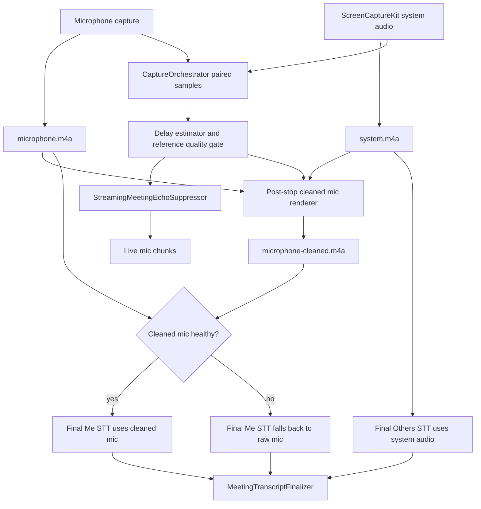
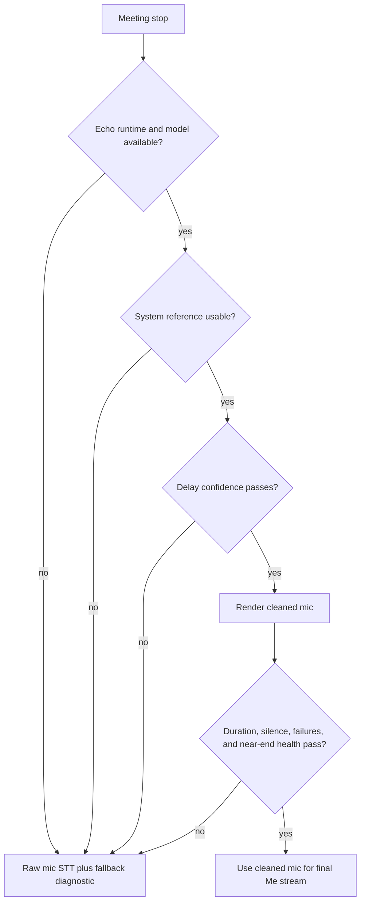

# Plan: Meeting AEC full close (#605 speaker bleed)

## Status

- **Priority**: P0 for meeting trust; P1 overall release blocker until verified
- **Effort**: L
- **Risk**: HIGH (audio quality, native assets, final transcript trust, user data artifacts)
- **Category**: fix / audio pipeline / meeting transcription
- **Planned at**: 2026-06-28
- **Baseline**: `main` after PR #624, `f70dea929`
- **Relates**: issue #605; issues #480/#430/#501/#542/#106; `plans/active/2026-06-27-meeting-aec-measurement-harness.md`; `docs/research/2026-06-meeting-aec-open-issues-prior-art.md`; ADR-014; `spec/05-audio-pipeline.md`; `spec/06-stt-engine.md`

## Implementation Progress (2026-06-28, branch `feat/meeting-aec`)

This branch lands the software keystone the measurement harness identified —
runtime reference-delay alignment — and defers the units that depend on native
assets or hardware that cannot be produced in a sandbox.

- **U1 — adaptive delay estimator: DONE.** `MeetingEchoDelayEstimator`
  (normalized cross-correlation, pre-emphasis, confidence gate) plus tests. On
  the harness a 600-sample bulk delay is uncancellable at static-zero (−2.7 dB)
  and the estimated delay restores it (56.5 dB).
- **U2 — adaptive delay in mic conditioning: DONE.**
  `StreamingMeetingEchoSuppressor` re-estimates its reference delay from paired
  audio on a cadence; the static `…REFERENCE_DELAY_MS` is the seed/override and
  `MACPARAKEET_MEETING_ECHO_ADAPTIVE_DELAY` (default on) gates it. Oversized
  manual delays are clamped to the adaptive search ceiling so fixed reference
  retention stays bounded. The factory builds the estimator for the
  dynamic-library path. Passthrough/asset-less paths are unchanged, so shipped
  builds are unaffected.
- **U7 — diagnostics: PARTIAL.** Delay, last-adopted confidence, adopted-count,
  and rejected-count added to `MeetingEchoSuppressionDiagnostics` (metadata
  only) and the existing `meeting_echo_suppression_summary` log. Feedback-surface
  wiring remains. The cleaned-mic render emits a `meeting_cleaned_mic` capture
  diagnostics line (outcome, processed/raw-fallback frames, failures, RMS ratio).
- **U3 — cleaned mic artifact rendering after stop: DONE** (branch
  `feat/meeting-aec-cleaned-mic`). `MeetingCleanedMicRenderer` (decode → align by
  recorded start offsets → condition through a freshly built suppressor → AAC
  encode) is wired into `MeetingRecordingService.stopRecording` (off-actor,
  dual-source only) and `MeetingRecordingRecoveryService`. `MeetingRecordingOutput`
  carries `cleanedMicrophoneAudioURL` and re-surfaces it via `loadArchived`.
  Retention deletes `microphone-cleaned.m4a` with the other managed audio.
- **U4 — prefer cleaned mic for final meeting STT: DONE.**
  `transcribeMeetingSources` resolves the `.microphone` source through
  `MeetingRecordingOutput.microphoneTranscriptionURL`, which prefers the cleaned
  file when present and falls back to raw otherwise. The "health gate" is
  presence + on-disk existence: the renderer guarantees every output frame is
  either echo-cancelled or raw-fallback (never worse than raw per frame), so no
  separate numeric runtime gate is applied. A global RMS/energy gate was
  deliberately NOT used — on a real meeting it cannot distinguish good echo
  removal (mic that was mostly bleed → correctly quiet) from a model that mutes
  near-end voice; that near-end-fidelity risk is owned by model selection
  (U5 chose echo-only v1.4) and real QA (U9), not a runtime heuristic.
- **U5 — release verification + model decision gate: IN PROGRESS.** The
  packaging/verification half landed in PR #646
  (`scripts/dist/verify_meeting_echo_assets.sh`, runtime asset gates). The model
  decision gate was scored on the synthetic harness (PR #650,
  `MeetingAecModelScoringTests`): **echo-only `localvqe-v1.4-aec-200K-f32` is the
  chosen release default candidate** because the joint `v1.2` model zeroes the
  near-end voice (retain 0.00) while v1.4 preserves it (retain ~1.0) at 35.6 dB
  ERLE — see "Model decision gate — result (2026-06-28)" under U5. Remaining U5:
  build/sign/notarize the proprietary universal `liblocalvqe.dylib` + bundle the
  chosen model, then flip `defaultModelName`.
- **U8 — docs: UPDATED.** `spec/05-audio-pipeline.md` and
  `spec/contracts/meeting-artifacts-v1.md` describe the derived artifact + STT
  routing. CLI artifact output intentionally omits the cleaned mic: it is an
  internal STT input, not a user-facing export the user opens.
- **U3/U4 are inert in shipped builds until U5 bundles assets** — production
  resolves to `PassthroughMicConditioner`, so `renderCleanedMicrophone` skips and
  final STT reads raw `microphone.m4a` exactly as today. Landing the wiring now is
  safe (no behavior change without assets), fully tested, and is the prerequisite
  for U9; it is no longer deferred.
- **U6/U9 — REMAINING.** U6: optional WebRTC AEC3 benchmark or skip-decision
  record. U9: real no-headphones speaker-mode QA closes #605.

## Goal Capsule

- **Objective**: Close the speaker-mode acoustic echo cancellation bug where system audio played through speakers bleeds into the microphone and creates duplicate false `Me` transcript content.
- **Authority order**: preserve raw user artifacts first, prove cleaned audio quality second, then improve transcript UX.
- **Execution profile**: implementation-ready, characterization-first, with metric gates before any default-on product behavior.
- **Stop conditions**: stop and re-plan if LocalVQE cannot be packaged/signature-verified, if cleaned audio damages near-end speech under double-talk, or if real speaker-mode QA cannot reproduce a clear improvement.
- **Tail ownership**: implementation is not done until synthetic metrics, final-STT behavior, packaged-asset verification, and real speaker-mode QA all pass.

---

## Product Contract

### Summary

MacParakeet already captures microphone and system audio separately, and it has a `MicConditioning` seam plus optional LocalVQE-compatible runtime loading.
The remaining bug is that production still behaves like raw mic passthrough unless private echo assets are present, and final meeting transcription still reads `microphone.m4a` instead of a cleaned mic source.
This plan turns the scaffold into a source-aware AEC product path while preserving raw `microphone.m4a` and `system.m4a` as truth.

### Problem Frame

Issue #605 reports meetings as unusable because remote/system audio is physically captured by the microphone.
Transcript-layer deletion and live system-dominance drops are useful safety nets, but they do not create a clean microphone signal and cannot make the final saved transcript trustworthy by themselves.
The shipped measurement harness proved that reference alignment is load-bearing: an aligned oracle cancels to the noise floor, while a 2.5 ms misalignment destroys cancellation.

### Requirements

**Source trust**

- R1. Preserve raw `microphone.m4a` and `system.m4a` for every meeting source mode that records them.
- R2. Produce a cleaned microphone path for final meeting transcription when system reference and echo runtime are available.
- R3. Keep VPIO as an explicit experimental mic mode only; do not make VPIO the default fix for speaker-mode meetings.

**AEC behavior**

- R4. Estimate or adapt microphone/reference delay instead of relying only on static `MACPARAKEET_MEETING_ECHO_REFERENCE_DELAY_MS`.
- R5. Process far-end-only speaker bleed into little or no false `Me` transcript content.
- R6. Preserve near-end local speech when the remote side is silent.
- R7. Preserve near-end local speech during double-talk while reducing far-end bleed.
- R8. Fall back to raw mic transcription with clear diagnostics when references, assets, timing, or processing fail.

**Artifacts and transcription**

- R9. Prefer the cleaned mic path for the final `Me` stream only after health gates pass.
- R10. Retain any `microphone-cleaned.m4a` derived artifact under the same retention and deletion rules as other meeting source audio.
- R11. Keep `meeting.m4a` as playback/export output and avoid treating it as the final STT input.

**Verification and closure**

- R12. Extend synthetic fixtures to score ERLE, near-end retention, delay recovery, nonlinear/reverberant echo, and double-talk.
- R13. Package or runtime-load LocalVQE assets with checksum/signature verification before default-on use.
- R14. Benchmark WebRTC AEC3 or record a decision artifact explaining why LocalVQE alone passed the release gates.
- R15. Close #605 only after at least one real Zoom/Meet/Teams speaker-mode recording passes manual QA without headphones.

### Acceptance Examples

- AE1. Far-end-only speaker playback: given system audio is active and the local user is silent, final transcript contains remote speech as `Others`/system content and no sustained false `Me` run.
- AE2. Near-end-only local speech: given the system reference is silent, the cleaned mic path preserves the local user's words and does not suppress the mic stream.
- AE3. Double-talk: given local and remote speech overlap, final transcript keeps local words while reducing duplicate remote words in the mic stream.
- AE4. Missing assets: given LocalVQE assets are absent or unreadable, recording completes with raw mic transcription and logs an explicit passthrough/fallback diagnostic.
- AE5. Bad reference alignment: given the reference cannot be confidently aligned, the cleaner either estimates a safe delay or falls back without silently damaging the mic.
- AE6. Retention cleanup: given meeting audio retention deletes source artifacts, the cleaned derived artifact is deleted with the same retention policy.

### Scope Boundaries

- This plan closes acoustic echo/speaker bleed. It does not solve speaker diarization quality, meeting summarization quality, or transcript editing.
- This plan may harden `MeetingTranscriptSourceReconciler` as a safety net, but transcript-layer deletion alone cannot satisfy the plan.
- This plan does not delete or replace raw source audio. Cleaned audio is a derived artifact.
- This plan does not make VPIO the default meeting mic path.
- This plan does not require a public UI control for choosing AEC engines before #605 is fixed.

---

## Planning Contract

### Key Technical Decisions

- KTD1. Use source-aware software AEC as the production fix. The product failure is acoustic bleed, so the microphone stream must be cleaned with the system-audio reference before final mic STT.
- KTD2. Keep raw artifacts authoritative. Raw mic/system files remain the recovery, audit, and fallback truth; cleaned mic is derived and health-gated.
- KTD3. Derive a cleaned mic artifact for final STT. Prefer `microphone-cleaned.m4a` or an equivalent retained/reproducible derived input so final transcription is not tied to live-preview-only samples.
- KTD4. Make delay estimation part of the runtime path. The measurement harness shows static delay is too fragile; a production cleaner needs confidence-scored delay recovery or adaptive reference handling.
- KTD5. LocalVQE is the first shipping candidate. The current runtime already expects LocalVQE symbols and 16 kHz / 256-sample frames, so finish that path first and use WebRTC AEC3 as the benchmark or fallback.
- KTD6. Default-on requires both synthetic and real-world gates. A clean test fixture is necessary but insufficient; #605 closes only with real speaker-mode QA.
- KTD7. Fallback must be observable. Silent passthrough is acceptable for dev builds but not as a release proof; logs and feedback diagnostics must show processor, loaded state, reference quality, delay confidence, processed frames, and fallback reason.

### High-Level Technical Design





### Implementation Sequencing

1. Make delay estimation and metrics production-ready before changing product behavior.
2. Integrate adaptive delay into `MicConditioning` and prove synthetic improvement.
3. Add post-stop cleaned mic artifact rendering while raw files remain untouched.
4. Teach final meeting STT to prefer the cleaned mic only when health gates pass.
5. Package and verify LocalVQE assets for release builds.
6. Run benchmark and real-meeting QA, then update specs and close issue #605.

### Assumptions

- LocalVQE can be built as a universal macOS dynamic library and signed/notarized with the app bundle.
- A cleaned mic artifact is acceptable as a derived meeting source file governed by existing retention policy.
- WebRTC AEC3 is a benchmark/fallback path, not a prerequisite if LocalVQE clears the gates by a strong margin.
- Existing `MeetingAudioCaptureService` host-time alignment is good enough for initial pairing, but audio-derived delay estimation is still required for echo-path latency and drift.

---

## Implementation Units

### U1. Productionize adaptive delay estimation

- **Goal:** Add a production-owned delay estimator that recovers bulk system-reference lag from paired mic/system samples with confidence scoring.
- **Requirements:** R4, R8, R12, AE5
- **Dependencies:** None
- **Files:**
  - `Sources/MacParakeetCore/Services/Capture/MeetingEchoDelayEstimator.swift`
  - `Sources/MacParakeetCore/Services/Capture/MicConditioner.swift`
  - `Tests/MacParakeetTests/Services/Capture/MeetingEchoDelayEstimatorTests.swift`
  - `Tests/MacParakeetTests/Services/Capture/MeetingAecMeasurementTests.swift`
- **Approach:** Use a normalized-correlation estimator with pre-emphasis and a confidence threshold. Treat silence or weak correlation as no estimate rather than forcing a lag. Keep it independent of LocalVQE so the harness, NLMS baseline, and any WebRTC benchmark can share it.
- **Execution note:** Start characterization-first from the existing measurement harness before wiring into runtime.
- **Patterns to follow:** `MeetingAecMeasurementHarness.swift` for synthetic scenarios; `MeetingEchoSuppressionDiagnostics` for small value diagnostics.
- **Test scenarios:**
  - Far-end-only single-tap echo at a known delay returns that delay within a narrow sample tolerance and confidence above threshold.
  - Multi-tap double-talk returns the dominant echo-path delay without being pulled to the local speaker.
  - Remote silence returns nil.
  - All-zero mic/reference returns nil.
  - A delay beyond the NLMS filter length fails with static zero delay but succeeds when the estimated delay is fed into `StreamingMeetingEchoSuppressor`.
- **Verification:** Delay estimator tests pass and the AEC harness shows estimated delay restores meaningful far-end cancellation beyond static-zero reach.

### U2. Wire adaptive reference delay into mic conditioning

- **Goal:** Make `StreamingMeetingEchoSuppressor` use adaptive or periodically refreshed reference delay while preserving existing static configuration as an override/fallback.
- **Requirements:** R4, R5, R6, R7, R8, AE1, AE2, AE3, AE5
- **Dependencies:** U1
- **Files:**
  - `Sources/MacParakeetCore/Services/Capture/MicConditioner.swift`
  - `Sources/MacParakeetCore/Services/Capture/MeetingEchoSuppressionRuntime.swift`
  - `Sources/MacParakeetCore/Services/Capture/CaptureOrchestrator.swift`
  - `Tests/MacParakeetTests/Services/Capture/MeetingEchoSuppressorTests.swift`
  - `Tests/MacParakeetTests/Services/Capture/MeetingAecMeasurementTests.swift`
  - `Tests/MacParakeetTests/Services/Capture/CaptureOrchestratorTests.swift`
- **Approach:** Add an adaptive-delay component around or inside `StreamingMeetingEchoSuppressor` that can update the effective `referenceDelaySamples` based on confidence-scored observations. Keep `MACPARAKEET_MEETING_ECHO_REFERENCE_DELAY_MS` as a manual seed/override rather than the only answer. Diagnostics should expose current delay, confidence, estimate count, rejected estimates, and fallback frames.
- **Technical design:** Directional shape: `MicConditioning` receives paired mic/reference batches, accumulates enough history for analysis, estimates delay when reference energy is present, and processes frames against the current delay. It must never emit raw held-tail samples except through the existing explicit `flush()` fallback.
- **Patterns to follow:** Existing frame-carry and reference-validity behavior in `StreamingMeetingEchoSuppressor`; environment parsing in `MeetingEchoSuppressionConfiguration`.
- **Test scenarios:**
  - With a known synthetic lag, processed frames use the estimated delay and improve ERLE over static zero.
  - When the estimator reports nil, the suppressor keeps the previous confident delay or falls back explicitly according to configuration.
  - When reference samples are partial or missing, diagnostics count partial/missing frames and no crash occurs.
  - Flush preserves remaining mic samples and records raw fallback diagnostics.
  - Reset clears pending mic, reference history, processor state, and adaptive delay state.
- **Verification:** Focused suppressor/orchestrator tests pass, and `MeetingAecMeasurementTests` still prove aligned-vs-misaligned behavior.

### U3. Add cleaned mic artifact rendering after stop

- **Goal:** Produce a durable `microphone-cleaned.m4a` derived artifact from raw mic/system files after meeting stop when cleanup is available.
- **Requirements:** R1, R2, R8, R10, R11, AE1, AE2, AE4, AE6
- **Dependencies:** U1, U2
- **Files:**
  - `Sources/MacParakeetCore/Services/MeetingRecording/MeetingCleanedMicRenderer.swift`
  - `Sources/MacParakeetCore/Services/MeetingRecording/MeetingRecordingService.swift`
  - `Sources/MacParakeetCore/Services/MeetingRecording/MeetingRecordingMetadata.swift`
  - `Sources/MacParakeetCore/Services/MeetingRecording/MeetingRecordingOutput.swift`
  - `Sources/MacParakeetCore/Services/MeetingRecording/MeetingRecordingRecoveryService.swift`
  - `Sources/MacParakeetCore/Services/MeetingRecording/MeetingArtifactStore.swift`
  - `Sources/MacParakeetCore/Audio/MeetingAudioStorageWriter.swift`
  - `Tests/MacParakeetTests/Services/MeetingRecording/MeetingRecordingServiceTests.swift`
  - `Tests/MacParakeetTests/Services/MeetingRecording/MeetingRecordingRecoveryServiceTests.swift`
  - `Tests/MacParakeetTests/Services/MeetingRecording/MeetingArtifactStoreTests.swift`
- **Approach:** Derive cleaned mic from finalized raw source files rather than adding a third real-time writer first. This keeps capture-risk low and lets the renderer reuse `MeetingSourceAlignment`, the selected echo runtime, and health gates before final STT. Persist enough metadata for recovery and later inspection.
- **Patterns to follow:** `MeetingAudioStorageWriter` source-file naming, `MeetingRecordingOutput` source URL conventions, recovery lock handling in `MeetingRecordingRecoveryService`.
- **Test scenarios:**
  - Dual-source meeting with available cleaner writes `microphone-cleaned.m4a` and records metadata pointing to it.
  - Microphone-only and system-only meetings skip cleaned rendering without error.
  - Missing/unreadable runtime assets skip cleaned rendering and preserve raw recording completion.
  - Renderer failure leaves `microphone.m4a`, `system.m4a`, and `meeting.m4a` intact.
  - Recovery reconstructs output correctly when raw files exist but cleaned artifact is absent.
  - Meeting audio retention/deletion removes `microphone-cleaned.m4a` together with other retained meeting source audio.
- **Verification:** Meeting recording, recovery, artifact-store, and retention tests prove cleaned artifact lifecycle without regressing raw artifact preservation.

### U4. Prefer cleaned mic for final meeting STT with health gates

- **Goal:** Route final `Me` transcription through the cleaned mic artifact only when it is present, decodable, duration-aligned, and healthy.
- **Requirements:** R2, R5, R6, R7, R8, R9, R11, AE1, AE2, AE3, AE4, AE5
- **Dependencies:** U3
- **Files:**
  - `Sources/MacParakeetCore/Services/TranscriptionService.swift`
  - `Sources/MacParakeetCore/Services/MeetingRecording/MeetingTranscriptFinalizer.swift`
  - `Sources/MacParakeetCore/Services/MeetingRecording/MeetingTranscriptSourceReconciler.swift`
  - `Tests/MacParakeetTests/Services/TranscriptionServiceTests.swift`
  - `Tests/MacParakeetTests/Services/MeetingRecording/MeetingTranscriptSourceReconcilerTests.swift`
  - `Tests/MacParakeetTests/Services/MeetingRecording/MeetingTranscriptFinalizerTests.swift`
- **Approach:** Update `transcribeMeetingSources` so `AudioSource.microphone` resolves to the cleaned mic candidate when health gates pass and raw mic otherwise. Keep system STT on `system.m4a`. Keep `MeetingTranscriptSourceReconciler` as a safety net for residual overlap, not the primary AEC mechanism.
- **Health gates:** cleaned file exists, decodes, duration is within tolerance of raw mic/source alignment, processor diagnostics show nonzero processed frames, failure/fallback ratio is below threshold, and near-end-only/silent-reference checks do not indicate destructive suppression.
- **Patterns to follow:** Existing source alignment offsets and vocabulary application in `TranscriptionService`; source reconciliation in `MeetingTranscriptFinalizer`.
- **Test scenarios:**
  - When cleaned mic is healthy, final microphone STT receives the cleaned file path.
  - When cleaned mic is missing, corrupt, too short, or mostly fallback frames, final microphone STT receives raw `microphone.m4a`.
  - System source STT remains `system.m4a` in both paths.
  - Final transcript still merges microphone/system words by `MeetingSourceAlignment`.
  - Residual simultaneous echo words are still removed by `MeetingTranscriptSourceReconciler`.
  - Cohere batch-only meeting finalize continues to work when word timestamps are unavailable.
- **Verification:** Transcription service tests prove file selection, fallback, and merge behavior; final transcript output uses cleaned `Me` only after gates pass.

### U5. Package and verify LocalVQE for release builds

- **Goal:** Make the LocalVQE runtime/model a release-verifiable asset instead of an optional local experiment.
- **Requirements:** R8, R13, AE4
- **Dependencies:** U2
- **Files:**
  - `Sources/MacParakeetCore/Services/Capture/MeetingEchoSuppressionRuntime.swift`
  - `Tests/MacParakeetTests/Services/Capture/MeetingEchoSuppressionRuntimeTests.swift`
  - `scripts/dist/build_app_bundle.sh`
  - `scripts/dist/verify_meeting_echo_assets.sh`
  - `docs/distribution.md`
  - `spec/05-audio-pipeline.md`
- **Approach:** Continue using `liblocalvqe.dylib` plus `MeetingEchoSuppression/localvqe-v1.2-1.3M-f32.gguf` or the selected v1.4 AEC model, but make release builds fail when required assets are missing. Keep dev builds able to run passthrough. Verify checksum, executable bit, dependency paths, and code signature where available.
- **Model decision gate:** Score v1.4 AEC and v1.2 joint models on the harness before choosing the release default. Prefer echo-only v1.4 if it preserves near-end better, even if v1.2 removes more noise.
- **Patterns to follow:** Existing `BUNDLE_MEETING_ECHO_ASSETS`, `REQUIRE_MEETING_ECHO_ASSETS`, and `MACPARAKEET_MEETING_ECHO_MODEL_SHA256` handling.
- **Test scenarios:**
  - Automatic mode with no bundled assets returns passthrough and logs unavailable state.
  - Dynamic-library-required mode with missing assets returns an unloaded LocalVQE diagnostics object.
  - Checksum mismatch rejects the model.
  - Bundled release verification fails if only one of library/model exists.
  - Bundled release verification passes when both assets exist, checksum matches, and dylib dependencies are acceptable.
- **Verification:** Runtime tests pass and distribution verification proves a release app either contains valid echo assets or intentionally refuses to claim AEC readiness.

#### Model decision gate — result (2026-06-28)

Scored the two real LocalVQE candidates through the **production-faithful**
conditioner (`MeetingEchoSuppressionFactory.makeConditioner(mode: .dynamicLibrary, …)`,
adaptive delay estimator on) on the synthetic harness, via the new env-gated
`MeetingAecModelScoringTests`. Deterministic and reproducible:

| model | far-end ERLE | near-end retain | double-talk vs raw (dtImpr) |
| --- | --- | --- | --- |
| `localvqe-v1.4-aec-200K-f32` (echo-only) | 35.6 dB | **1.02 — voice preserved** | −6.1 dB\* |
| `localvqe-v1.2-1.3M-f32` (joint AEC+denoise) | 66.2 dB | **0.00 — voice removed** | −3.5 dB\* |

`retain` = output/mic RMS on the near-end-only scenario (~1.0 keeps the local voice,
0 = silent). The adaptive estimator locked the true 120-sample echo delay for both.

**Decision: ship `localvqe-v1.4-aec-200K-f32` (echo-only) as the release default
candidate**, by the gate's rule (best near-end retention at acceptable far-end ERLE;
prefer echo-only v1.4 on a tie):

- The joint **v1.2 model zeroes the near-end voice** (retain 0.00) when the remote is
  silent — its denoise front-end acts on the microphone regardless of the reference, so
  it treats the local talker as noise. Its 66 dB ERLE is *real* echo removal, but it is
  achieved by **non-selective muting**: the same model also zeroes the output in the
  near-end-only and double-talk scenarios (retain 0.00, with **zero processing
  failures** — this is genuine model behavior, not raw-fallback frames). This is the
  disqualifying "chews up the user's own voice" failure the gate exists to catch, and it
  is **structural, not a tone artifact**: an echo-only canceller cannot remove the
  near-end when the reference is silent, a joint denoiser will.
- The echo-only **v1.4 model preserves near-end energy** (retain ~1.0, zero processing
  failures) while still removing strong far-end echo (35.6 dB) — ample to suppress the
  speaker bleed that produces false `Me` text.

\***Caveat — the honest limit of this gate (sharpened by independent review).** Both
models show a *negative* synthetic double-talk improvement, and v1.4's near-end error is
positive (+4.5 dB). This is **consistent with** synthetic-tone reshaping — the harness
near-end is decorrelated formant tones, not speech, and a neural enhancer trained on real
speech reshapes those tones so that exact-waveform error is penalized even when energy is
preserved. But the harness **cannot distinguish** that benign hypothesis from genuine
waveform damage (spectral coloring, phase/group-delay smear) that would also hurt real
speech. So the gate **negatively screens** (it cleanly rejects v1.2's unambiguous
near-end destruction) but **cannot positively certify** double-talk fidelity for *either*
model. This decision selects v1.4 as the candidate to **bundle and QA**; it does **not**
establish that v1.4's near-end is safe. Real speaker-mode QA (U9) is the binding gate
before any default-on, per KTD6, and must confirm on real speech that (a) the local voice
stays intelligible and undistorted and (b) far-end echo does not appear in the `Me`
transcript. If v1.4's double-talk near-end is still damaged on real speech, the
echo-only-vs-joint choice — or LocalVQE itself (WebRTC AEC3, plan U6) — must be revisited.

**Follow-up (its own reviewed change, not done in the scoring branch).** When a
canceller is bundled, set `MeetingEchoSuppressionFactory.defaultModelName` to
`localvqe-v1.4-aec-200K-f32.gguf` (currently `localvqe-v1.2-1.3M-f32.gguf`) and bundle
that file via `MACPARAKEET_MEETING_ECHO_MODEL_SRC`/`_NAME`. The runtime resolves
`Resources/MeetingEchoSuppression/<defaultModelName>`, so the constant and the bundled
basename must match.

**Reproduce:**

```bash
MACPARAKEET_TEST_LOCALVQE_LIBRARY=/path/to/liblocalvqe.dylib \
MACPARAKEET_TEST_LOCALVQE_MODELS=/path/to/v1.4-aec.gguf:/path/to/v1.2.gguf \
swift test --filter MeetingAecModelScoringTests
```

Scored assets (sha256): `localvqe-v1.4-aec-200K-f32` `b6e43138…3c731`;
`localvqe-v1.2-1.3M-f32` `4856ecf5…2ba9ce`. The repo-internal `gtcrn_aec.gguf` is not a
loadable LocalVQE model in this runtime and is excluded by the test's load preflight. The
test skips when the env vars are unset, so CI stays green without the private assets.

### U6. Benchmark WebRTC AEC3 or record the skip decision

- **Goal:** Compare LocalVQE against a mature reference AEC path, or record a justified decision that LocalVQE alone clears the release bar.
- **Requirements:** R12, R14
- **Dependencies:** U1, U2, U5
- **Files:**
  - `Tests/MacParakeetTests/Services/Capture/MeetingAecMeasurementHarness.swift`
  - `Tests/MacParakeetTests/Services/Capture/MeetingAecMeasurementTests.swift`
  - `docs/research/2026-06-meeting-aec-open-issues-prior-art.md`
  - `plans/active/2026-06-28-meeting-aec-full-close.md`
  - Optional if implemented: `Sources/MacParakeetCore/Services/Capture/WebRTCAec3MeetingEchoProcessor.swift`
- **Approach:** Treat WebRTC AEC3 as a benchmark/fallback rather than immediate product scope unless LocalVQE fails synthetic or real QA. If a prototype is feasible in the implementation window, score it on the same fixtures. If not, update the decision record with the LocalVQE metrics that justify shipping without it.
- **Patterns to follow:** LocalVQE runtime abstraction through `MeetingEchoSuppressing`; research note's Prismical/WebRTC API shape.
- **Test scenarios:**
  - A benchmark processor can run through `MeetingAecRunner` with far-end-only, near-end-only, and double-talk scenarios.
  - Benchmark output records ERLE and near-end retention in the same format as LocalVQE/NLMS.
  - If skipped, the plan/research note states the decision, the reason, and the metrics that made WebRTC non-blocking.
- **Verification:** Reviewer can compare LocalVQE to either a WebRTC result table or a written skip decision tied to passing LocalVQE gates.

### U7. Extend diagnostics, feedback evidence, and user-facing fallback surfaces

- **Goal:** Make AEC state visible enough to debug user reports and close #605 with evidence.
- **Requirements:** R7, R8, R13, R15, AE4, AE5
- **Dependencies:** U2, U3, U4, U5
- **Files:**
  - `Sources/MacParakeetCore/Audio/AudioCaptureDiagnostics.swift`
  - `Sources/MacParakeetCore/Services/MeetingRecording/MeetingRecordingService.swift`
  - `Sources/MacParakeetCore/Services/Capture/MicConditioner.swift`
  - `Sources/MacParakeetCore/Services/Capture/MeetingEchoSuppressionRuntime.swift`
  - `Sources/MacParakeet/Views/Feedback/FeedbackView.swift`
  - `Tests/MacParakeetTests/Audio/DiagnosticLogScopeTests.swift`
  - `Tests/MacParakeetTests/Services/MeetingRecording/MeetingRecordingServiceTests.swift`
  - `docs/human-qa-guide.md`
- **Approach:** Extend `meeting_echo_suppression_summary` with delay, confidence, cleaned artifact status, selected input path for final STT, processor version/model, fallback reason, and health-gate result. Keep uploaded diagnostics metadata-only; never include audio or transcript content.
- **Patterns to follow:** Existing `meeting_recording_health` and feedback diagnostic upload scope.
- **Test scenarios:**
  - Successful cleaned path logs processor loaded, delay confidence, processed frame count, cleaned artifact URL basename, and final-STT source choice.
  - Missing assets logs passthrough/fallback reason.
  - Failed health gate logs fallback reason without exposing transcript text or audio samples.
  - Feedback diagnostic scope includes AEC summary lines within existing size/time caps.
- **Verification:** Uploaded diagnostic logs can distinguish "AEC worked", "AEC skipped by configuration", "AEC tried and fell back", and "final STT used raw".

### U8. Update specs, contracts, and CLI/artifact visibility

- **Goal:** Align durable docs and automation surfaces with the cleaned mic artifact and AEC release rules.
- **Requirements:** R1, R2, R9, R10, R11, R15, AE6
- **Dependencies:** U3, U4, U7
- **Files:**
  - `spec/05-audio-pipeline.md`
  - `spec/06-stt-engine.md`
  - `spec/adr/014-meeting-recording.md`
  - `spec/contracts/meeting-artifacts-v1.md`
  - `Sources/CLI/Commands/MeetingsCommand.swift`
  - `Tests/CLITests/MeetingsCommandTests.swift`
  - `docs/human-qa-guide.md`
  - `docs/distribution.md`
- **Approach:** Document that raw source files remain truth, cleaned mic is a derived artifact, final meeting STT may prefer cleaned mic after health gates, and retention applies to cleaned audio. Expose cleaned artifact presence in any existing meeting artifact listing without making users manage it separately.
- **Patterns to follow:** Existing meeting artifact folder/CLI conventions and boundary contract docs.
- **Test scenarios:**
  - CLI meeting artifact output includes cleaned mic when present and omits it cleanly when absent.
  - Contract tests cover retention/deletion of cleaned mic alongside raw source audio.
  - Spec text no longer implies passthrough is the only production AEC state once assets are shipped.
- **Verification:** Specs/contracts/CLI agree on artifact names, lifecycle, and final STT source preference.

### U9. Real speaker-mode QA and issue closure

- **Goal:** Prove #605 is resolved in the failure mode users hit: laptop speakers feeding the microphone during real meetings.
- **Requirements:** R5, R6, R7, R12, R15, AE1, AE2, AE3, AE4, AE5
- **Dependencies:** U1, U2, U3, U4, U5, U7, U8
- **Files:**
  - `docs/human-qa-guide.md`
  - `docs/research/2026-06-meeting-aec-open-issues-prior-art.md`
  - `plans/active/2026-06-28-meeting-aec-full-close.md`
  - Optional evidence artifacts under an appropriate private/local QA location, not committed if they contain audio/transcript content.
- **Approach:** Run real speaker-mode recordings with no headset, using Zoom/Meet/Teams or equivalent far-end playback. Capture diagnostic metadata and inspect raw mic, system, cleaned mic, final transcript, and `meeting.m4a`. Do not close the issue from synthetic tests alone.
- **QA scenarios:**
  - Far-end-only: remote speech plays through speakers while local user is silent.
  - Near-end-only: local user speaks while system reference is silent.
  - Double-talk: local and remote speakers overlap.
  - Asset failure: run without echo assets and confirm graceful raw fallback.
  - Reference stress: introduce a delayed/brief system stream interruption and confirm fallback or recovery is logged.
- **Verification:** QA notes show before/after behavior, artifact inspection, diagnostics lines, and a direct #605 closure statement. If QA fails, leave #605 open with the failed gate named.

---

## Verification Contract

| Gate | Scope | Done signal |
| --- | --- | --- |
| `swift test --filter MeetingEchoDelayEstimatorTests` | U1 | Delay estimation handles far-end, double-talk, silence, and beyond-filter lag. |
| `swift test --filter MeetingAecMeasurementTests` | U1, U2, U5, U6 | Harness reports aligned cancellation, misalignment failure, LocalVQE/WebRTC or documented benchmark decision, and double-talk retention. |
| `swift test --filter MeetingEchoSuppressorTests` | U2 | Frame carry, adaptive delay, partial/missing reference, reset, and flush behavior hold. |
| `swift test --filter MeetingRecordingServiceTests` | U3, U7 | Cleaned artifact lifecycle and diagnostics are covered. |
| `swift test --filter TranscriptionServiceTests` | U4 | Final meeting STT prefers cleaned mic only after health gates. |
| `swift test --filter MeetingRecordingRecoveryServiceTests` | U3 | Recovery tolerates absent cleaned artifact and preserves raw sources. |
| `swift test --filter MeetingsCommandTests` | U8 | CLI/artifact listing reflects cleaned mic presence. |
| `scripts/dist/verify_meeting_echo_assets.sh <app>` | U5 | Release bundle contains valid echo assets when AEC is claimed. |
| `swift test` | All | Full suite passes before declaring implementation complete. |
| Manual speaker-mode QA | U9 | Real no-headset meeting proof satisfies AE1, AE2, and AE3. |

### Synthetic Metric Gates

- Pass-through far-end-only ERLE remains near 0 dB as the sanity baseline.
- Oracle with true delay remains above 50 dB ERLE on the deterministic fixture.
- Oracle with a 2.5 ms offset remains below 6 dB ERLE, proving the harness still detects misalignment.
- Selected production engine achieves meaningful far-end-only ERLE improvement over raw in steady state.
- Near-end-only cleaned output remains close to raw/local speech and does not become silent.
- Double-talk cleaned output must not degrade near-end retention beyond the threshold documented in the test, and the threshold must be strict enough to reject the current naive NLMS tradeoff if it hurts local speech.

---

## Risks & Dependencies

- **Native asset packaging risk:** `liblocalvqe.dylib` and model files add signing, notarization, dependency, and bundle-size work. Mitigate with U5 release verification.
- **Double-talk quality risk:** naive cancellers can remove echo but damage local speech. Mitigate with double-talk gates before default-on.
- **Delay/drift risk:** mic and ScreenCaptureKit streams may drift during long meetings. Mitigate with adaptive delay diagnostics and long-run fixtures.
- **Privacy risk:** QA and feedback evidence must not commit or upload audio/transcript content accidentally. Keep diagnostics metadata-only.
- **CPU/latency risk:** live preview cleanup and post-stop rendering can compete with STT. Measure and fallback rather than blocking recording stop indefinitely.
- **False confidence risk:** transcript cleanup may make visible text look better while raw mic remains polluted. Definition of Done requires cleaned audio artifact or equivalent final-STT input.

---

## Documentation / Operational Notes

- Update `docs/human-qa-guide.md` with explicit #605 QA scenarios and artifact inspection steps.
- Update `docs/distribution.md` so release builders know whether echo assets are required for a given channel.
- Update `spec/contracts/meeting-artifacts-v1.md` before exposing `microphone-cleaned.m4a` through CLI or retention flows.
- Keep issue #605 open until U9 passes; partial synthetic success should be reported as progress, not closure.

---

## Sources & Research

- `plans/active/2026-06-27-meeting-aec-measurement-harness.md` - shipped harness, first ERLE numbers, alignment/double-talk findings.
- `docs/research/2026-06-meeting-aec-open-issues-prior-art.md` - LocalVQE, Muesli, WebRTC AEC3, Anarlog/Hyprnote, Corti, and release-proof recommendations.
- `spec/05-audio-pipeline.md` - current raw/default mic capture, optional `StreamingMeetingEchoSuppressor`, final source-file STT architecture.
- `Sources/MacParakeetCore/Services/Capture/MicConditioner.swift` - passthrough and streaming echo suppressor seam.
- `Sources/MacParakeetCore/Services/Capture/MeetingEchoSuppressionRuntime.swift` - LocalVQE-compatible dynamic library/model loader.
- `Sources/MacParakeetCore/Services/TranscriptionService.swift` - final meeting source transcription path that must prefer cleaned mic after gates.
- `scripts/dist/build_app_bundle.sh` and `scripts/dist/verify_meeting_echo_assets.sh` - existing echo asset packaging hooks.

---

## Definition of Done

- U1-U8 are implemented with focused tests and full `swift test` passing.
- Release bundle verification proves echo assets are present and valid when the build claims AEC support.
- Final meeting STT uses cleaned mic for the `Me` stream when health gates pass and raw mic when they fail.
- Raw `microphone.m4a` and `system.m4a` remain preserved and recoverable.
- `microphone-cleaned.m4a` or the equivalent derived cleaned input follows meeting audio retention/deletion rules.
- Diagnostic logs distinguish loaded, skipped, failed, and fallback AEC states.
- Specs, contracts, distribution docs, and human QA guide describe the new artifact and behavior.
- Real speaker-mode QA without headphones passes far-end-only, near-end-only, and double-talk scenarios.
- Issue #605 is closed only with the QA evidence summarized; otherwise it remains open with the failed gate named.
- Abandoned experimental code, dead benchmark scaffolding, and unused native wrapper attempts are removed before landing.
